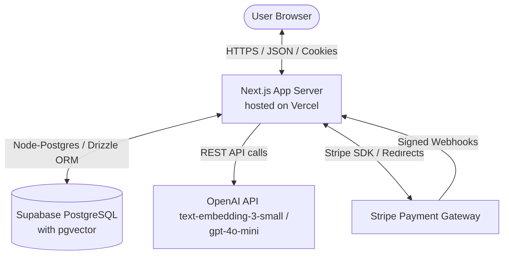
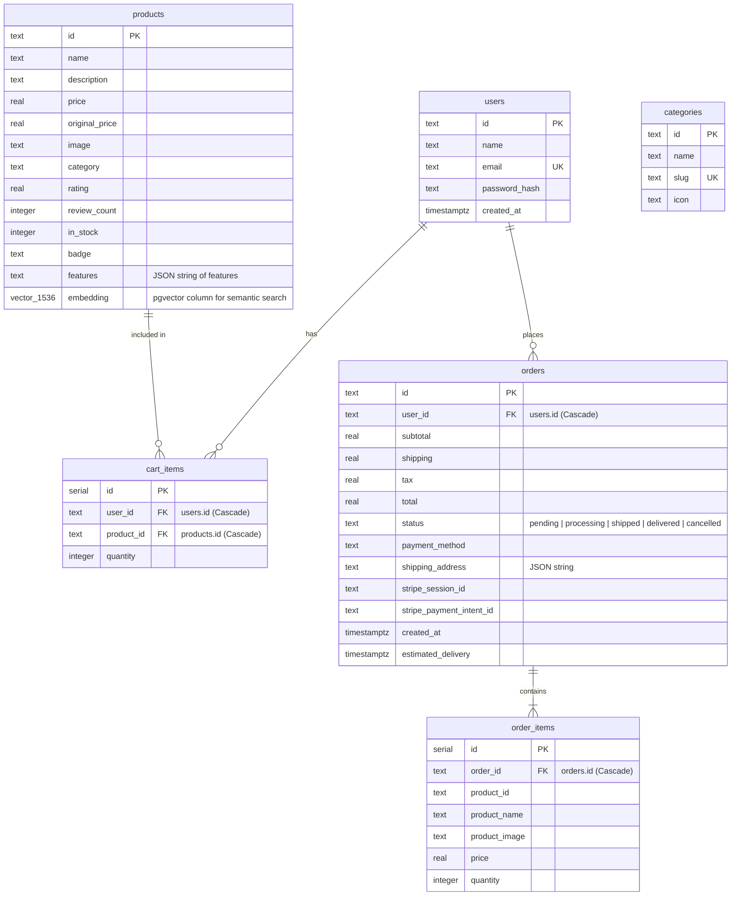
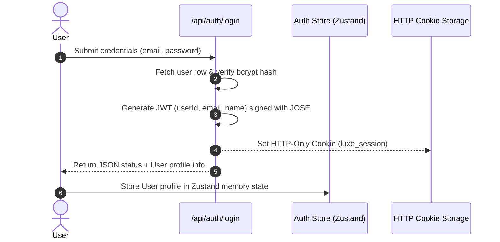
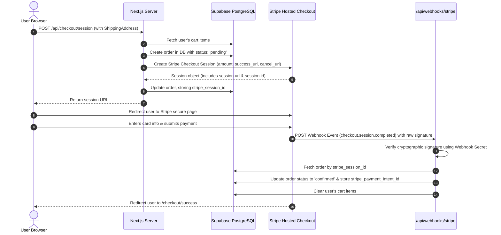
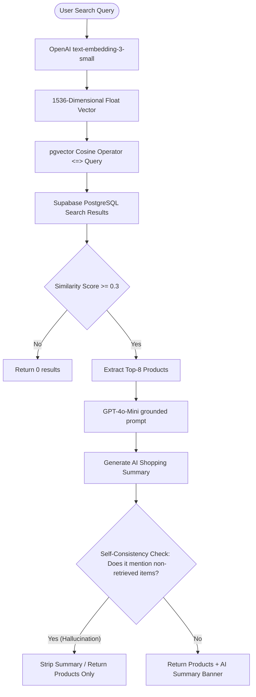

# LUXE Store — Production Upgrade Architecture

A comprehensive documentation of the production-grade e-commerce architecture of **LUXE Store**. This document reviews the high-level system topology, database layout, data flows, APIs, and security configurations designed for summer research showcase compliance.

---

## 1. System Overview

The LUXE Store is a full-stack Next.js application built with a decoupled React frontend and Next.js App Router API backend. It uses **Supabase** for database hosting, **Stripe** for payment processing, and **OpenAI** for vector similarity embedding & natural language summarization.



---

## 2. Database Schema (ERD)

The database layers are managed via **Drizzle ORM** targeting a PostgreSQL database. Below is the Entity-Relationship Diagram showing all schemas, column types, relationships, and the `pgvector` embedding integration.



### Database Indexes & Constraints
1. **`users.email` (Unique)**: Lowercase-constrained index enforcing account uniqueness.
2. **`categories.slug` (Unique)**: High-speed query indexing for category navigation.
3. **`cart_items_user_product_idx` (Unique)**: Composite unique index over `(user_id, product_id)` ensuring a product appears at most once in a user's cart, allowing increment-on-collision logic.
4. **Foreign Key Cascades**: If a user is deleted, their `cart_items` and `orders` cascade-delete. If a product is deleted, its `cart_items` cascade-delete (order items retain static copies of product info for purchase auditing integrity).

---

## 3. Authentication & Session Lifecycle

LUXE Store uses stateless custom JWT-based authentication. Client sessions are stored in cryptographically signed, secure, HTTP-only cookies to protect against Cross-Site Scripting (XSS).



### Session Details & Security
- **Algorithm**: `HS256` signed using the Jose library.
- **Expiration**: JWT expires after 7 days.
- **Cookies**: Enforces `HttpOnly` (preventing JS reading), `Secure` (only HTTPs), `SameSite: Lax` (CSRF prevention), and `Path: /`.

---

## 4. Stripe Checkout & Fulfillment Flow

LUXE Store implements an offloaded Stripe checkout flow (PCI DSS SAQ-A compliant). No card data passes through the application server; instead, payment is conducted entirely on Stripe's secure environment.



---

## 5. AI-Powered Semantic Search & RAG Pipeline

Instead of a simple keyword search, LUXE Store implements a full Retrieval-Augmented Generation (RAG) search pipeline that provides semantic search and natural language summaries, while enforcing strict anti-hallucination guardrails.



### Anti-Hallucination Details
- **Context Injection**: The LLM system prompt is injected with the retrieved product titles, descriptions, and prices.
- **Reference Extraction**: An exact regular-expression reference matcher maps quoted strings in the response back to product titles returned by the SQL vector search. If there is a mismatch, the summary is immediately discarded.

---

## 6. API Endpoint Reference

### 1. `POST /api/auth/register`
Creates a new user account.
- **Request Body**:
  ```json
  {
    "name": "Jane Doe",
    "email": "jane@example.com",
    "password": "securepassword123"
  }
  ```
- **Response (200)**:
  ```json
  {
    "success": true,
    "user": {
      "id": "usr-uuid...",
      "name": "Jane Doe",
      "email": "jane@example.com",
      "createdAt": "2026-06-19T14:24:19Z"
    }
  }
  ```

### 2. `POST /api/auth/login`
Authenticates a user and sets the JWT session cookie.
- **Request Body**:
  ```json
  {
    "email": "jane@example.com",
    "password": "securepassword123"
  }
  ```
- **Response (200)**:
  ```json
  {
    "success": true,
    "user": {
      "id": "usr-uuid...",
      "name": "Jane Doe",
      "email": "jane@example.com"
    }
  }
  ```

### 3. `GET /api/cart`
Retrieves items currently in the logged-in user's shopping cart.
- **Response (200)**:
  ```json
  {
    "success": true,
    "items": [
      {
        "quantity": 2,
        "product": {
          "id": "prod-001",
          "name": "Nova Pro Wireless Headphones",
          "price": 299.99,
          "inStock": true,
          "features": ["Active Noise Cancellation", "40-hour battery life"]
        }
      }
    ]
  }
  ```

### 4. `POST /api/checkout/session`
Creates a Stripe Checkout session and registers a pending order.
- **Request Body**:
  ```json
  {
    "shippingAddress": {
      "fullName": "Jane Doe",
      "address": "123 luxury lane",
      "city": "Beverly Hills",
      "state": "CA",
      "zipCode": "90210",
      "country": "USA",
      "phone": "+15550199"
    }
  }
  ```
- **Response (200)**:
  ```json
  {
    "success": true,
    "sessionId": "cs_test_...",
    "sessionUrl": "https://checkout.stripe.com/c/pay/cs_test_..."
  }
  ```

### 5. `POST /api/webhooks/stripe`
Receives webhook event notifications from Stripe.
- **Headers**:
  - `Stripe-Signature`: Webhook payload cryptographic signature.
- **Request Body**: Raw text payload sent by Stripe.
- **Response (200)**:
  ```json
  {
    "received": true
  }
  ```

### 6. `GET /api/search/semantic`
Performs RAG-grounded vector similarity search against products.
- **Query Parameters**:
  - `q` (string): Natural language description.
- **Response (200)**:
  ```json
  {
    "success": true,
    "products": [
      {
        "id": "prod-001",
        "name": "Nova Pro Wireless Headphones",
        "price": 299.99,
        "similarityScore": 0.812
      }
    ],
    "summary": "Based on your interest in wireless audio, I found the Nova Pro Wireless Headphones ($299.99) which feature studio-quality sound and active noise cancellation.",
    "metadata": {
      "query": "something for high quality audio",
      "queryEmbeddingTimeMs": 140,
      "searchTimeMs": 20,
      "totalResults": 1,
      "aiAvailable": true,
      "guardrailApplied": false
    }
  }
  ```

---

## 7. Security Protocols

1. **SQL Injection Mitigation (Drizzle ORM)**:
   - Drizzle constructs parameterized queries automatically, isolating dynamic parameter inputs from the query parser compiler.
2. **Cryptographic Webhook Validation**:
   - Webhooks are verified using Stripe's official SDK with `stripe.webhooks.constructEvent(body, signature, secret)`. This prevents payload spoofing.
3. **HTTP-only JWT Cookies**:
   - Authentication tokens are flagged with `HttpOnly` and `SameSite=Lax` to eliminate XSS-based session highjacking and protect against Cross-Site Request Forgery (CSRF).
4. **Password Hashing**:
   - Client passwords are encrypted using `bcryptjs` with a cost factor of `10` rounds, preventing raw text compromise in the database layer.
5. **AI Hallucination Filtering**:
   - Similarity filters, low temperature completion presets, and reference cross-matching prevent generating recommendations for non-existent products.

---

## 8. Deployment Target Specifications

- **Frontend Application Hosting**: Hosted on **Vercel** as a Serverless next-generation application. Dynamic routes evaluate as Serverless functions on regional edges, and client pages deliver via global CDNs.
- **Database Architecture**: Hosted on **Supabase** (PostgreSQL 15+). Communicates via connection pooling over Port 5432 / Transaction Port 6543 (using PgBouncer for concurrent serverless connection pooling). Enables `pgvector` to store and query high-dimensional embeddings.
